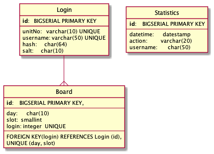

### setup database commands
1. add postgreSQL `heroku addons:create heroku-postgresql:hobby-dev`
   response
```bash
Creating heroku-postgresql:hobby-dev on ⬢ sheltered-ridge-72628... free
Database has been created and is available
! This database is empty. If upgrading, you can transfer
! data from another database with pg:copy
Created postgresql-parallel-87688 as DATABASE_URL
Use heroku addons:docs heroku-postgresql to view documentation
```

2. install pg in npm `npm i pg`
3. run command with `heroku pg:psql`
   copy sql from database file to create database here


